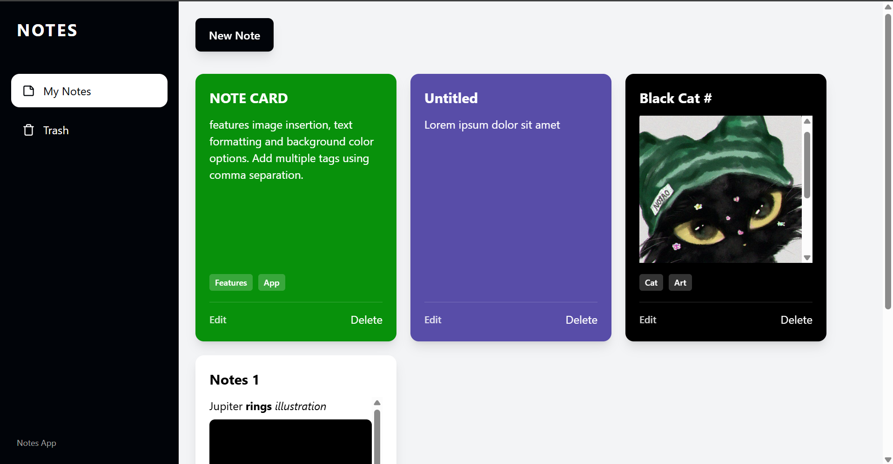
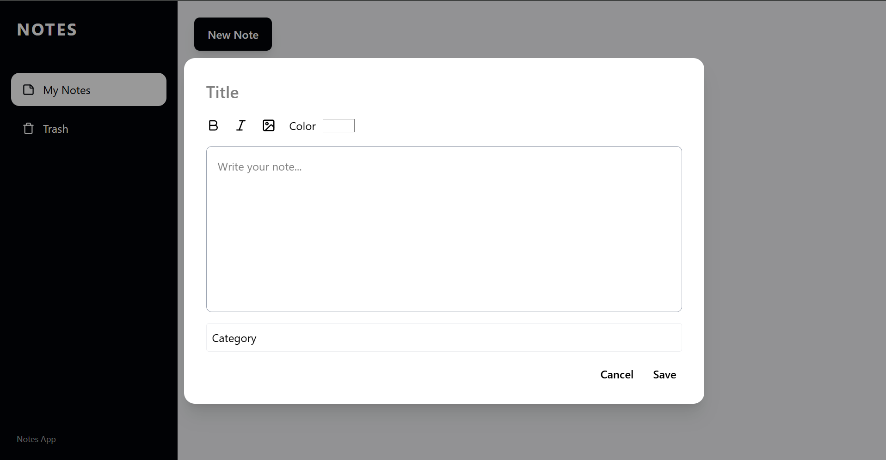
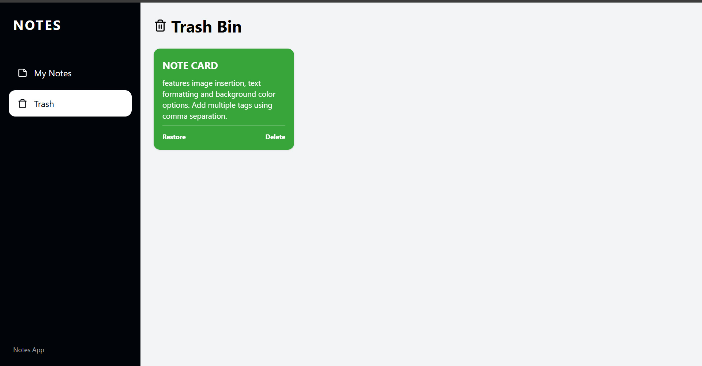

# Notes App

## Features
* **CRUD Architecture:** create, read, update, and delete notes 
* **Dynamic Color:** A custom algorithm that automatically calculates background hex brightness and auto-switches between black and white text according to note card color.
* **Text Formatting:** Regular, italics, bold.
* **Image Insertion:** Supports image insertion from device.
* **Tagging:** Assign custom category tags to individual notes.
* **Trash System:** soft-delete feature allowing for accidental deletion recovery before permanent deletion.

## Technical Stack
* **Frontend:** React.js, Vite, Tailwind CSS, Lucide Icons
* **Backend:** Node.js, Express.js
* **Database:** MongoDB

## Local Installation & Setup

### Prerequisites
* Node.js installed on your machine.
* **MongoDB** installed and running locally (port 27017). Ensure your MongoDB service/daemon (`mongod`) is active before starting the backend.

### Running the Application
This project is a monorepo containing a React frontend and a Node.js backend (/server). You will need two terminal windows to run the application.

**1. Clone the repository:**

**2. Start the Backend Server (Terminal 1):**
`bash
cd server
npm install
npm run dev`

**3. Start the Frontend Application (Terminal 2):**
Open a new terminal from the root directory:**
`npm install
npm run dev
`

## Application Showcase
### Dashboard

### Notes Editor

### Trash

